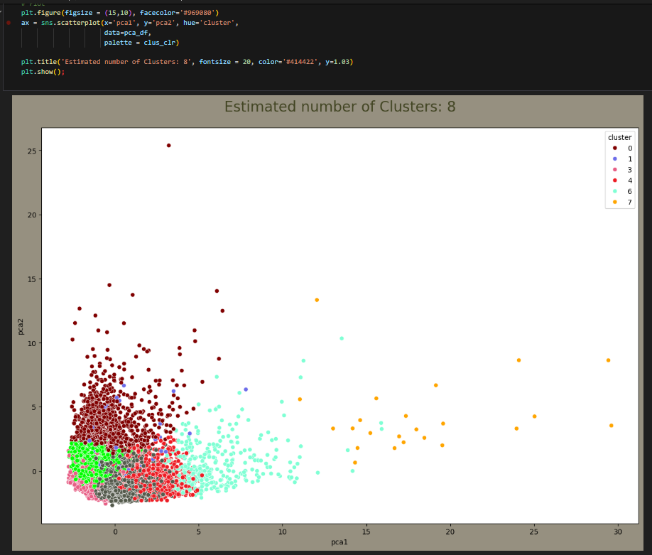

# Credit Card Customer Segmentation Analysis Using Unsupervised Learning

This repository contains the code and resources for a Credit Card Customer Segmentation project. The goal of this project was to analyze and segment customers of a bank using unsupervised learning techniques. The segmentation helps in understanding the distinct groups of customers, allowing for targeted marketing strategies to enhance customer satisfaction and optimize marketing campaigns.

## Project Overview

### Data Processing and Cleaning
- **Data Source**: 8,000 records of bank customer data spanning over 6 months.
- **Tools Used**: Python, NumPy, pandas.
- **Techniques**: Data imputation, exploratory data analysis (EDA).

### Exploratory Data Analysis (EDA)
- Conducted EDA to understand data distributions, detect anomalies, and identify patterns.
- Visualized data using matplotlib, plotly, and seaborn.

### Unsupervised Learning
- **Clustering Algorithm**: K-Means clustering.
- **Dimensionality Reduction**: Principal Component Analysis (PCA) for visualization and feature reduction.
- **Cluster Determination**: Methods used to determine the optimal number of clusters.

### Insights and Recommendations
- Segmented customers into distinct groups based on their spending behavior and other features.
- Provided actionable insights for targeted marketing.
- Demonstrated the effectiveness of the model in improving customer satisfaction and optimizing marketing strategies.

## Repository Contents

- `data/`: Contains the dataset used for the analysis.
- `notebooks/`: Jupyter notebooks with detailed step-by-step analysis and code.
  - Data Cleaning and EDA
  - Clustering and PCA
  - Insights and Recommendations
- `src/`: Python scripts for data processing, clustering, and visualization.
- `reports/`: Final report and presentation summarizing the findings and recommendations.
- `README.md`: Project overview and instructions.

## Getting Started

### Prerequisites

Ensure you have the following libraries installed:
- NumPy
- pandas
- matplotlib
- plotly
- scikit-learn
- seaborn

### Installation

Clone the repository:
```bash
git clone https://github.com/srujanra/Credit-Card-Customer-Segmentation-Analysis-Using-Unsupervised-Learning.git

cd credit-card-customer-segmentation
```

### Usage

1. **Data Preparation**:
   - Place the dataset in the `data/` folder.
   - Run the data cleaning and EDA notebook to preprocess the data.

2. **Clustering and Visualization**:
   - Execute the clustering notebook to perform K-Means clustering and PCA.
   - Visualize the customer segments.

3. **Insights and Recommendations**:
   - Review the insights and recommendations notebook for actionable marketing strategies.

## Contributing

Contributions are welcome! Please open an issue or submit a pull request for any improvements or new features.

## Acknowledgements

- Thanks to the open-source community for the libraries and tools used in this project.
